# Using Google Apps Script: Create a todo web app

> I have added links to the terms I've mentioned in this blog. There's no need to hastily click on each link as you read along (I understand how overwhelming that can be). Instead, I suggest you navigate through the entire tutorial first without clicking any links. You can revisit the links at your leisure to delve deeper into the topics.

> [Use this link](https://script.google.com/macros/s/AKfycbwhSQySSkOVk5Mv4N9_y-MFF1DVOY_uU3mRWpkIx4mI-5iyQsNpp9tAY8P5Q_RGnmW5/exec) to view the final todo app we will be building. If you want to deploy "CoolTodoApp" on your own account and use it personally, [use this link](https://script.google.com/macros/s/AKfycbzSsEGHd56mxZv-1TnJ1abSW4bqlD1OI7ciFYL6L8bYsCX1SBUgosvSzXXss1xBIY3cEw/exec). You will be asked for some permissions, review and approve it by [following this](https://developers.google.com/static/apps-script/images/unverified-app-ui.gif). [This](https://github.com/sauravshah31/technical-blogs/google-apps-script-1/src) is the final source code.


## Topics covered
* [Why to use Apps Script](#why-to-use-apps-script)
* [Getting started with google apps script](#getting-started-with-google-apps-script)
* [Create a todo app: Getting started](#create-a-todo-app-getting-started)
* [Google script: Server side GET and POST endpoints](#google-script-server-side-get-and-post-endpoints)
* [Rendering client-side UI using HTMLService](#rendering-client-side-ui-using-htmlservice)
* [Communicating with the server](#communicating-with-the-server)
* [Templated HTML: Dynamic HTML rendering](#templated-html-dynamic-html-rendering)
* [Refactoring code into html, css, js and gs files](#refactoring-code-into-html-css-js-and-gs-files)
* [Building client-side UI](#building-client-side-ui)
* [Using Drive Service](#using-drive-service)
* [Using Spreadsheet Service](#using-spreadsheet-service)
* [Using Charts Service](#using-charts-service)
* [Generating PDF report](#generating-pdf-report)
* [Sending Email](#sending-email)
* [Triggering events](#triggering-events)
* [Using Lock Service](#using-lock-service)
* [Meta tag and client side metadata](#meta-tag-and-client-side-metadata)
* [Building server-side API](#building-server-side-api)
* [Deploying final CoolTodoApp](#deploying-final-cooltodoapp)

## Why to use Apps Script
Google Apps Script is a development platform provided by Google that can be used to create applications that integrate with Google Workspace. Using [app services](https://developers.google.com/apps-script/reference) you can easily access Google apps like Docs, sheets, drive, etc. and automate stuff in JavaScript. You can use app script to create [add-ons](https://developers.google.com/workspace/add-ons/overview), create a client-facing [web app](https://developers.google.com/apps-script/guides/web), [automate stuff](https://developers.google.com/apps-script/quickstart/automation), use it as a backend server for your simple apps or create fun projects. The app script is based on JavaScript, so knowing the basics of JS should be enough to [get started](https://developers.google.com/apps-script/overview).


## Getting started with google apps script
Let's get started. Go to [script.new](https://script.new) to create a new Google app script. Let's give the project a name `CoolTodoApp`.
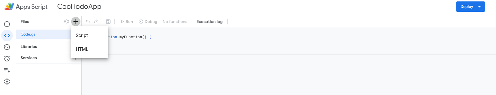
Google App script allows two kinds of files
1. Script file: This is the .gs file (eg: code.gs) that contains server-side logic
2. HTML: This is the HTML file that can be used to build UI. The JS and CSS logic also goes in this file

You can add multiple files to your project. For the `Script file`, all the objects are exposed globally. This means you can use the objects defined/declared in one file from any file without needing to import them. For `HTML file`, the server GET endpoint renders a single HTML file. You can then use server-side functions to "import" / "include" other HTML files. You will have clarity once we start using these later.

Now, let's try printing something in the console. Add some console log statements in `myFunction` function and try running the function. 

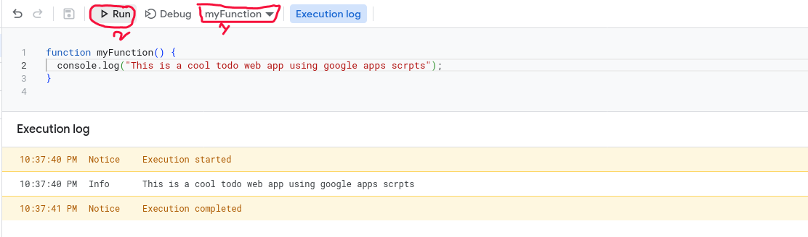

You can see the "Execution log". This method of running can be used to debug your code or test some functions. To the left of the `Run` button, there is a `Debug Button`. You can add [breakpoints](https://en.wikipedia.org/wiki/Breakpoint) by clicking the line no, then run the function step by step. This is very helpful to debug code.


## Create a todo app: Getting started
Now we can start creating our app. In this tutorial, we will be creating a todo app with a custom client-facing UI. We will be storing the todo list of a day in a spreadsheet. The spreadsheets for the entire month will be stored inside the month folder in Google Drive. We will also set up a notification event, that will send an email on the first of every month with the summary of todos for the previous month.

Before starting to code, we need to think of the requirements of our app. We will have a client-facing UI that lists the todos for the day and allows us to add/remove todos and a server that stores the data. Our requirement is simple:
1. Client-facing UI shall have to display the following
    * List of todos for the day, and a button to delete it
    * An input field that allows the user to add new todo task

2. The server shall handle the following
    * Return list of todos for a day
    * Store any new todo task
    * Send email on the first of every month with the summary of the previous month

Now that we have the product requirements clear, we can start with the technical requirements. This includes the UI design, the server architecture and choices, etc. We will start with the UI design. I have created this simple UI in Figma for our web app. A rough sketch of the UI in the paper should also be enough to get started. 

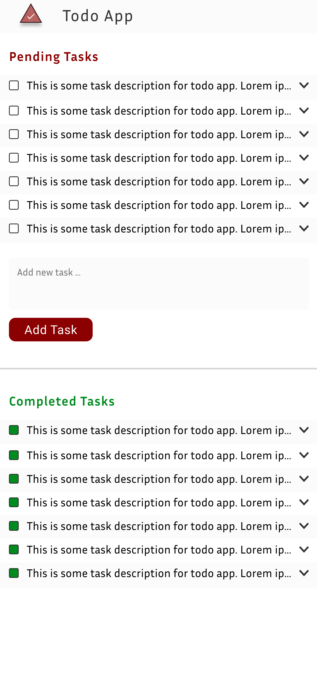

Now we can start thinking about the how server should handle the requests. We know using app scripts we can interact with spreadsheet, drive, docs, etc. We will use Google spreadsheets to store the user todos. To keep things organized, we create a new spreadsheet for each day. We also create a folder for each month and store all the spreadsheets for a month in the respective folders. For the monthly report, we will summarize the data from all the spreadsheets and create a PDF file. We will then send this pdf file to the email as an attachment. We know these operations are possible using [app script services](https://developers.google.com/apps-script/reference), but don't know how to do it yet. Throughout this tutorial, you will learn different aspects of Google app script and app services, and use it to build a complete todo app.


## Google script: Server side GET and POST endpoints
Before starting to code, let's see how gs (Google script) can be used as a server. Two common methods to talk to a server are [GET](https://developer.mozilla.org/en-US/docs/Web/HTTP/Methods/GET) and [POST](https://developer.mozilla.org/en-US/docs/Web/HTTP/Methods/POST). So, we need a way to handle these two requests in gs. App Scripts provides [two functions](https://developers.google.com/apps-script/guides/web) to handle these requests: `doGet(e)`, `doPost(e)`. The `e` is the request parameter and contains the request data. Refer to the [documentation](https://developers.google.com/apps-script/guides/web) to know more. 

So, we have to define these functions in our `gs` script file, and the return value will be returned as a response to the user. The return value should be of type [HtmlOutput](https://developers.google.com/apps-script/reference/html/html-output) or [TextOutput](https://developers.google.com/apps-script/reference/content/text-output), otherwise, you will get an error. To return a value of this type, you can use [HtmlService](https://developers.google.com/apps-script/reference/html/html-service) or [Content Service](https://developers.google.com/apps-script/reference/content). A service in the Google apps script is a utility class that contains useful methods that you can use to interact with Google apps.

Let's modify the `Code.gs` file. First, let's clean up by removing the `myFunction` function. Then, add `doGet` function and return some string using [`HtmlService.createHtmlOutput(html)`](https://developers.google.com/apps-script/reference/html/html-service#createHtmlOutput(String)) function
```js
function doGet(e)
{
  return HtmlService.createHtmlOutput("This is a cool web todo web app made using google app script");
}
```  

Now, you need to deploy your web app. Click `Deploy` (on the top right) and select `Test deployments`. Select the type as `Web app`, Execute as "Me", Who has access "Anyone" and then click "Deploy". You will get an URL. Open it in another tab. You should see the output.


## Rendering client-side UI using HTMLService
We can use [HTMLService](https://developers.google.com/apps-script/reference/html) to serve html file to the client. Basically, we need to return a HTML file from `doGet` function. You can return a html file using [`createHtmlOutputFromFile(filename)`](https://developers.google.com/apps-script/reference/html/html-service#createhtmloutputfromfilefilename).

Let's try out an example. First, Add a new file (HTML). Let's name it `index`. Now, let's add some html.
```html
<!DOCTYPE html>
<html>
  <head>
    <base target="_top">
  </head>
  <body>
    <p>This is a cool todo app made using google app script.</p>
  </body>
</html>
```

Now, in return this file in the `doGet` function in `Code.gs`
```js
function doGet(e)
{
  return HtmlService.createHtmlOutputFromFile("index.html")
}
```
You can either use `index.html` or `index` as a filename. Google app script doesn't allow you to add more than one file with the same name, even if it is a script and HTML file. If you open the URL (from the test deployment), you should see this html file being served.


## Communicating with the server
There is a way to call server-side functions, from your client-side js or even html. This is the easiest way to talk to your server. You can use [Client-side API](https://developers.google.com/apps-script/guides/html/communication) to call the server-side API. Basically, you use `google.script.run.yourFunction()`, where `yourFunction()` is defined in the script file (server-side). You can pass most of the datatypes as an argument to the function, and the same will be available on the server. Similarly, `yourFunction()` can return values, which will be available to your client side.

Let's start with a simple example. The client-side sends the client's current date to the server, and the server logs it to the console. Note that Date datatype is not allowed as an argument, so we convert it to string.
In the server-side code `Code.gs`, add the `logUserDate` function.
```js
function logUserDate(date)
{
  Logger.log(`user_date : ${date}`);
}
```
Now we can call this `logUserDate` from client-side js. Modify `index.html`
```html
<!DOCTYPE html>
<html>
  <head>
    <base target="_top">
  </head>
  <body>
    <p>This is a cool todo app made using google app script.</p>
    <script>
      let userdate = new Date();
      google.script.run.logUserDate(userdate.toString());
    </script>
  </body>
</html>
```

You can now refresh the webpage URL. Go to the script editor, and open the `Executions` tab. All the server logs will be displayed here. You can see that there are two execution logs, first for the `doGet` that returns the web page to the client, and then for the `logUserDate`, which is called from the client side js.
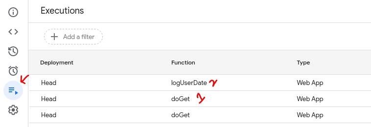

How does it work, you might be wondering. Well, the utility, provided by [`google.script.run`](https://developers.google.com/apps-script/guides/html/reference/run), does the HTTP call for you. It will send a [POST](https://developer.mozilla.org/en-US/docs/Web/HTTP/Methods/POST) request to the server. The server parses the request, calls the correct function and returns the value as a response to the client. This is called [Remote procedure call](https://en.wikipedia.org/wiki/Remote_procedure_call). If you look at your browser network tab, you will see a [POST](https://developer.mozilla.org/en-US/docs/Web/HTTP/Methods/POST) request sent to the server. The request data is a form data in this format `request	'["logUserDate","[\\"Your date string"]",null,[0],null,null,1,0]'`.

You can use the [Client-side API](https://developers.google.com/apps-script/guides/html/communication) to get back the data from the server using [`withSuccessHandler(function)`](https://developers.google.com/apps-script/guides/html/reference/run#withsuccesshandlerfunction) callback. Similarly, you can use [`withFailureHandler(function)`](https://developers.google.com/apps-script/guides/html/reference/run#withsuccesshandlerfunction) callback to handle the errors while making the request.

Let's see an example. Say you have a server function `getSum(a,b)` that calculates the sum of two numbers `a` and `b`.
```js
const getSum = (a,b) => {
  return a+b;
}
```

On the client side js, we can get back the results using the [`withSuccessHandler(function)`](https://developers.google.com/apps-script/guides/html/reference/run#withsuccesshandlerfunction) callback. The parameter passed to the callback function is the return value from the server (the sum in this case).
```js
<script>
const a = 3;
const b = 4;

const printSum = (result) => {
  console.log(`The sum of ${a},${b} is ${result}`);
};

google.script.run.withSuccessHandler(printSum).getSum(a,b);
</script>
```

Note that the functions starting with `underscore`('\_') are not exposed to the client. If you want to write a "private" function that can't be called directly by the client, you can prepend the function name with "\_". For example, the following `_getFileDataFromDrive` can't be called by the user directly. However, the client can call the `getData` function which will then call the `_getFileDataFromDrive`. This is a common pattern for internal utility functions and exposing them through an interface.
```js
const APP_ROOT_FOLDER = "CoolTodoApp";


/*This function is not exposed to the client*/
const _getFileDataFromDrive = (fileId) => {
  let file = DriveApp.getFileById(fileId);
  let data = file.getBlob();
  return data
}

/*This is the interface exposed to the client to get the data from a file*/
const getData = (filename) => {
  let fileId = _searchFile(CONSTANTS.APP_ROOT_FOLDER, filename); //_searchFile is another private function that searches for the filename and returns it's id
  let data = "";
  if(fileId !== "")
  {
    data = _getFileDataFromDrive(fileId);
  }
  return data;
}
```


## Templated HTML: Dynamic HTML rendering
[Templated HTML](https://developers.google.com/apps-script/guides/html/templates) allows you to render dynamic HTML pages. It allows you to dynamically add sections to your html, before sending it to the client. If you are familiar with other [template engines](https://en.wikipedia.org/wiki/Template_processor) like [Jinja](https://jinja.palletsprojects.com/en/3.1.x/), [EJS](https://ejs.co/), etc, it is similar to those. You can embed code inside your HTML document, and the server renders those to get a complete HTML, before sending to the client. 
To add dynamic logic to your HTML you can use [these syntaxes](https://developers.google.com/apps-script/guides/html/templates#scriptlets):
* To execute code without outputting any content to the template.
```
<? your logic ?>
eg: <? if(some dondition) ?>
```
Use it if you trust the source the data is coming from, and the data to be rendered is some script. In the above example, data.user_script is rendered by the server and replaced with a js code.

* To render output using contextual escaping.
```
<?= data / variable ?>
eg: <p><?= data.user_name ?> logged in</p>
```

* To render output without using contextual escaping.
```
<?!= data / variable?>
eg:  <p><?!= data.static_data ?> logged in</p>
```

Use this if the data source is not trusted, or anytime you don't need to dynamically add some script. Escaped output means the output is the literal string as provided in the input. It is achieved by adding [escape characters](https://en.wikipedia.org/wiki/Escape_character) instead of evaluating them.

To create a templated HTML, you can use [`HTMLService.createTemplateFromFile(filename)`](https://developers.google.com/apps-script/reference/html/html-service#createtemplatefromfilefilename). This will return a template file from the file you have given. To render it (evaluate the template code), use [`evaluate()`](https://developers.google.com/apps-script/reference/html/html-template#evaluate). You can also pass data to the template, by setting the template HTML's `data` variable. Let's try an example. We will show the visitor count to the user.

Let's start with the template html `index.html`
```html
<!DOCTYPE html>
<html>
  <head>
    <base target="_top">
  </head>
  <body>
    <p>You are the <?= data.visitor_count?> visitor</p>
  </body>
</html>
```
Here, `data.visitor_count` will return the visitor count. 

For the server side, we will keep track of the visitor in a global variable, and return that in the template. Please note that global variables are not persistent by default, meaning each time you run the script, the global variables will be allocated again and they will get initialized again. So, you can't simply keep track of the visitors using global count. We will be using [Properties Service](https://developers.google.com/apps-script/guides/properties) to create a "persistent" property. Let's modify `code.gs`.
```js
function doGet(e)
{
  let scriptProperties = PropertiesService.getScriptProperties();
  if(!scriptProperties.getProperty('visitor_count'))
  {
    //initialize the visitor_count
    scriptProperties.setProperty('visitor_count', 0);
  }

  //increament the visitor_count for each user
  let visitor_count = scriptProperties.getProperty('visitor_count');
  visitor_count++;
  scriptProperties.setProperty('visitor_count', visitor_count);

  //Render the htl template by passing the visitor_count data
  let template = HtmlService.createTemplateFromFile("index.html");
  template.data = {
    visitor_count
  };
  visitor_count += 1;
  const rendered_html = template.evaluate();
  return rendered_html;
}
```

If you open the test deployment URL, each time you refresh the browser, you should see the count increase.

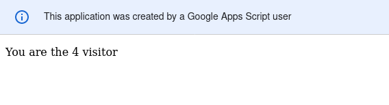

## Refactoring code into html, css, js and gs files
Now that we know the basics of how Google app script works, we can start coding our application. But, let's see how to [structure](https://developers.google.com/apps-script/guides/html/best-practices) our code first. As you might have seen, you can only add a "Script" or "HTML" file in your script. However, you can put your HTML, CSS and JS into multiple HTML files and then render it as a single file to the user. You can also have multiple gs files.
Let's see how you can refactor your frontend HTML, CSS and JS. You create a template HTML, call the server-side function to "include" other files and render that HTML template to get the entire page.

You can refer to [this for the complete source code](https://github.com/sauravshah31/technical-blogs/tree/3ab9e68980ae95df975d8d474594716dba242da3/google-apps-script-1/src) and have a look at [this for the final web app](https://script.google.com/macros/s/AKfycbzohvgmcQHS2SsOew80xAbK9FA9qhuHlN7ZNMqULjWTiC1nmkbYhyHxpsHzE8v7JNDttw/exec) for the complete source code. `index.html` is a template HTML that "includes" other HTML files.
```html
<!DOCTYPE html>
<html>
  <head>
    <base target="_top">
    <?!= include('stylesheet'); ?>
  </head>
  <body>
    <div id="root">
      <?!= include('header'); ?>
      <div class="line"></div>
      <?!= include('body'); ?>
      <div class="line"></div>
      <?!= include('footer'); ?>
    <div>
      <?!= include('javascript'); ?>
  </body>
</html>
```

On the server side, we have a function `include(filename)` that returns HTML output from the file. `index.html` template code is calling this server-side function.
```js
function include(filename) {
  return HtmlService.createHtmlOutputFromFile(filename)
      .getContent();
}
```

## Building client-side UI
We should now start with client-side UI. We already have the UI design for our web app. I will put the design again here.


Now, looking at the UI, we structure our client-side HTML into three files. We will also have one file each for CSS and JS. `index.html` is the template HTML file, that includes all other files. Here are the client-side files:
```txt
├── style.html
├── client-script.html
├── header.html
├── pending-tasks.html
├── completed-tasks.html
├── index.html
```

I will skip the client-side HTML code explanation. You can follow the design to code your client-side app. First start with a static web page, with dummy data, that has all the blocks from the design. Then you can start integrating the backend, and fetch data dynamically. You can refer to [this for the source code of the static web page](https://github.com/sauravshah31/technical-blogs/tree/8601671ffbfd96781f0f61ef24e60ead8d3b722a/google-apps-script-1/src) and [this for the final web page](https://script.google.com/macros/s/AKfycbyOe6mqMmDwKtjYsIViTNFpHzIYhMfw1PEpWow5BhxXTY1maeQQ7hx3gUxL9heYQ3t-3Q/exec). One thing to note is the header part. I have linked Bootstrap CDN, just like you would have done normally. Note that [meta tags included directly in an Apps Script HTML file are ignored](https://developers.google.com/apps-script/reference/html/html-output#detailed-documentation). Also, note how I have loaded the icon (in [header.html](https://github.com/sauravshah31/technical-blogs/tree/8601671ffbfd96781f0f61ef24e60ead8d3b722a/google-apps-script-1/src/header.html)) from the file stored in Google Drive. You can use this URL (shared with all) to include images from Google Drive: `https://drive.google.com/uc?id=drive_id&amp;export=download&amp;format=img_format`.

## Using Drive Service
Google app script provides some built-in services to interact with Google services like Google Drive, Google Admin Console, etc. `Services` are objects that expose some APIs which can be used to talk to Google apps. Let's build an app that allows the user to download files stored in Google Drive. We will use the [Drive Service](https://developers.google.com/apps-script/reference/drive).
```js
const doGet = (e) => 
{
  let filename = "";
  if("filename" in e.parameter)
  {
    filename = e.parameter["filename"];
  }

  return HtmlService.createHtmlOutput(`filename : ${filename}`);
}
```

The code above shows how you can get the query string the user passes. You can [refer to this](https://developers.google.com/apps-script/guides/web) to learn more about other data contained in the `e` parameter of `doGet` function. The user will pass the filename as a query parameter, and the server will return the file to the user. An example of a query string passed by the user is `https://script.google.com/macros/s/app_id/dev?filename=test`.

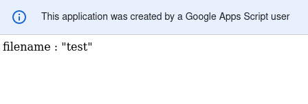

```js

const APP_ROOT_FOLDER = "CoolTodoApp";

/*
This function will create folder with name "foldername"
in the Google Drive's root folder
*/
const _createFolder = (foldername) => {
  let folderObj = null;
  let folderExists = DriveApp.getFoldersByName(foldername);
  if(folderExists.hasNext() === true)
  {
    //Folder already exists, get the id for that folder
    folderObj = folderExists.next();
  }
  else
  {
    //Folder doesn't exists, create new folder
    folderObj = DriveApp.createFolder(foldername);
  }
  return folderObj;
}

/*
This function will create a dummy file with name "filename" 
under folder (folderObj object) with size "filesz" bytes.
*/
const _createDummyFile = (filename, folderObj, filesz) => {
  let fileExists = folderObj.getFilesByName(filename);
  if(fileExists.hasNext())
  {
    console.log(`file (${filename}) already exists`);
    return null;
  }
  //create dummy data
  let content = "";
  for(let i=0; i<filesz; i++)
  {
    content += "e";
  }
  return folderObj.createFile(filename, content);
}

/*
This function will create bunch of files for testing our application
*/
const _testCreateFile = () => {
  // This will create "CoolTodoApp" folder
  // We will be using this folder for any testing
  let rootFolderObj = _createFolder(APP_ROOT_FOLDER);

  _createDummyFile("file1.txt", rootFolderObj, 1024);
  _createDummyFile("file2.txt", rootFolderObj, 1024);
  _createDummyFile("file3.txt", rootFolderObj, 1024);
}
```

The code above will create some dummy files under the folder "CoolTodoApp". [`DriveApp.getFoldersByName`](https://developers.google.com/apps-script/reference/drive/drive-app#getfoldersbynamename) will search the entire Google drive (not just the root folder). The return value is a [`FolderIterator`](https://developers.google.com/apps-script/reference/drive/folder-iterator) which can be navigated like a [linked list](https://en.wikipedia.org/wiki/Linked_list). It has a method named [`hasNext`](https://developers.google.com/apps-script/reference/drive/folder-iterator#hasnext) which returns `true` if there is another entry with that name. The [`next`](https://developers.google.com/apps-script/reference/drive/folder-iterator#next) method increments the iterator to point to the next object. You should always check if there is another object in the iterator using [`hasNext`](https://developers.google.com/apps-script/reference/drive/folder-iterator#hasnext) before calling [`next`](https://developers.google.com/apps-script/reference/drive/folder-iterator#next). You can call [`next`](https://developers.google.com/apps-script/reference/drive/folder-iterator#next) sequentially to iterator through all the entries. [`DriveApp.createFolder`](https://developers.google.com/apps-script/reference/drive/drive-app#createfoldername) can be used to create a folder in the root of the user's Drive. Similarly, [`Folder.createFolder`](https://developers.google.com/apps-script/reference/drive/folder#createfoldername) can be used to create a folder in a particular folder pointed by the [Folder](https://developers.google.com/apps-script/reference/drive/folder) object. [`Folder.createFile`](https://developers.google.com/apps-script/reference/drive/folder#createfilename,-content) can be used to create a file in a particular folder.

You can now run the `_testCreateFile` function using the [script editor's run button](#getting-started-with-google-apps-script). If you are running it for the first time, you will be asked to review permission.

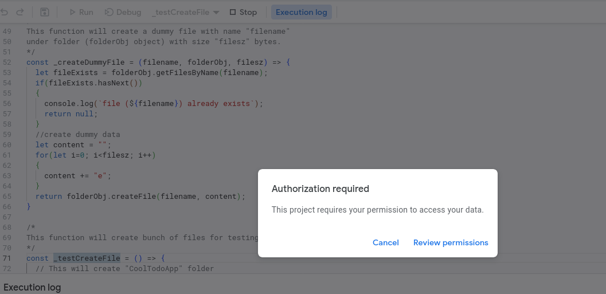

Click on the "Review permissions". Then click on "Advanced" and then continue to CoolTodoApp.

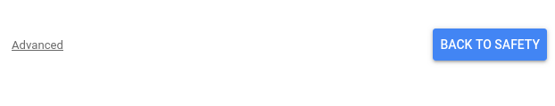

After reviewing the permissions, you should be able to run the function. It will create 3 files under "CoolTodoApp" Folder.

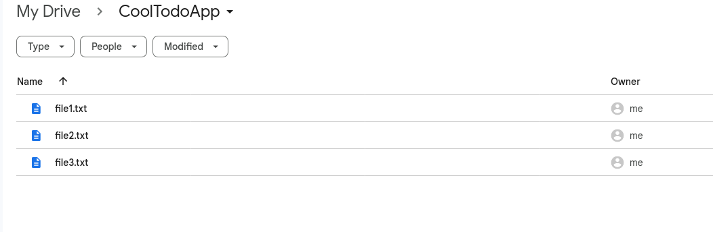

```js

const APP_ROOT_FOLDER = "CoolTodoApp";

/*
This function will search for file named "filename" under folder "folder"
and return the fileid
*/
const _searchFile = (filename, folder) => {
  let fileId = "";
  let folderExists = DriveApp.getFoldersByName(folder);
  if(folderExists.hasNext() === true)
  {
    let folderObj = folderExists.next();
    let fileExists = folderObj.getFilesByName(filename);
    if(fileExists.hasNext())
    {
      fileId = fileExists.next().getId();
    }
  }
  return fileId;
}

const doGet = (e) => 
{
  let filename = "";
  if("filename" in e.parameter)
  {
    filename = e.parameter["filename"];
  }

  let fileId = _searchFile(filename, APP_ROOT_FOLDER);

  if(fileId === "")
  {
    return HtmlService.createHtmlOutput(`${filename} not found`);
  }

  let fileObj = DriveApp.getFileById(fileId);
  let downloadUrl = fileObj.getDownloadUrl();
  return HtmlService.createHtmlOutput(`<script>window.location.replace("${downloadUrl}")</script>`);
}
```

`_searchFile` will check if a file exists in a folder and return the ID of the file using [`File.getId`](https://developers.google.com/apps-script/reference/drive/file#getid). The `doGet` function then gets the file by id using [`DriveApp.getFileById`](https://developers.google.com/apps-script/reference/drive/drive-app#getfilebyidid) and gets the download link using [`File.getDownloadUrl`](https://developers.google.com/apps-script/reference/drive/file#getdownloadurl). Note how I have prepended the `_searchFile` function with an underscore (\_) to prevent exposing it to the client. 

The return value of `doGet` function is a [HtmlOutput](https://developers.google.com/apps-script/reference/html/html-output) with a script that redirects the user to the download link. As we can't return [File](https://developers.google.com/apps-script/reference/drive/file) or [Blob](https://developers.google.com/apps-script/reference/base/blob.html) directly, I am redirecting the user to the download endpoint. You can also display the download URL instead of redirecting.

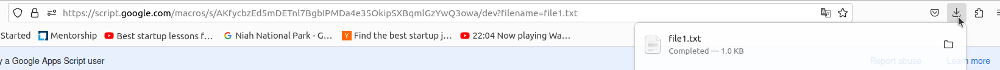

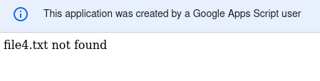

## Using Spreadsheet Service
Like the [Drive Service](#using-drive-service), you can use the [Spreadsheet Service](https://developers.google.com/apps-script/reference/spreadsheet) to interact with Google Sheets. Let's see how to create a new spreadsheet and save it in the drive.
```js
const APP_ROOT_FOLDER = "CoolTodoApp";

/*
This function creates a Google Sheet named "tasks"
and moves it to the App's folder
*/
const _createSheet = () => 
{
  //Get the app folder
  let appFolder = DriveApp.getFoldersByName(APP_ROOT_FOLDER);
  if(appFolder.hasNext())
  {
    appFolder = appFolder.next();
  }
  else
  {
    console.log(`${APP_ROOT_FOLDER} not created`);
    return;
  }

  //create a new spreadsheet
  let sheetFile = SpreadsheetApp.create("tasks");
  //Move the spreadsheet to the app folder
  DriveApp.getFileById(sheetFile.getId()).moveTo(appFolder);
}
```

If you run this function, you will be asked to review the permissions again as you are not using another service. After execution, you should see a spreadsheet named "tasks" in the app's folder.

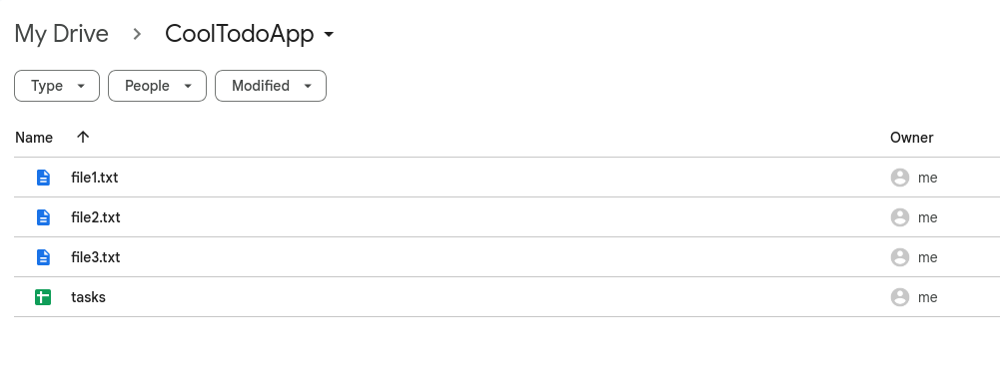

[`SpreadsheetApp.create`](https://developers.google.com/apps-script/reference/spreadsheet/spreadsheet-app#createname) can be used to create a new spreadsheet. [`File.moveTo`](https://developers.google.com/apps-script/reference/drive/file#movetodestination) is used to move a file to a different folder.

Now, we add some rows to the sheet.
```js
const APP_ROOT_FOLDER = "CoolTodoApp";

/*
This function adds some tasks to Google Spreadsheet
*/ 
const _addRows = () => {
  //Get the app folder
  let appFolder = DriveApp.getFoldersByName(APP_ROOT_FOLDER);
  if(appFolder.hasNext())
  {
    appFolder = appFolder.next();
  }
  else
  {
    console.log(`${APP_ROOT_FOLDER} not created`);
  }

  //search the sheet
  let sheetFile = appFolder.getFilesByName("tasks");
  if(sheetFile.hasNext())
  {
    sheetFile = sheetFile.next();
  }
  else
  {
    console.log("spreadsheet tasks not created");
    return;
  }

  //open the spreadsheet using SpreadSheetApp class
  let spreadsheet = SpreadsheetApp.open(sheetFile);
  //get the first sheet
  let sheet = spreadsheet.getSheets()[0];

  //Add header
  sheet.appendRow(["task_id", "task_description", "completed", "createad_on"])
  
  //Add some dummy tasks
  let today = new Date;
  sheet.appendRow(["1", "This is some task for testing", false, today.toUTCString()])
  sheet.appendRow(["2", "This is one more task", false, today.toUTCString()])
  sheet.appendRow(["3", "This is a completed task", true, today.toUTCString()])
  sheet.appendRow(["4", "This is another completed tasks", true, today.toUTCString()])
}
```

First, we open the file as a spreadsheet using [`SpreadsheetApp.open`](https://developers.google.com/apps-script/reference/spreadsheet/spreadsheet-app#openfile). This will return a [Spreadsheet](https://developers.google.com/apps-script/reference/spreadsheet/spreadsheet) object. Each spreadsheet has 1 or more sheets. We can get all the sheets using [`getSheets`](https://developers.google.com/apps-script/reference/spreadsheet/spreadsheet#getsheets). This will return an array of all sheets, indexed in the same order as they were stored. We use the first sheet by getting the 0th index element in the array. Finally, we add a header and some tasks using [`Sheet.appendRow`](https://developers.google.com/apps-script/reference/spreadsheet/sheet#appendrowrowcontents). If you run the `_addRows` function, you will see that the sheet is populated with some rows.

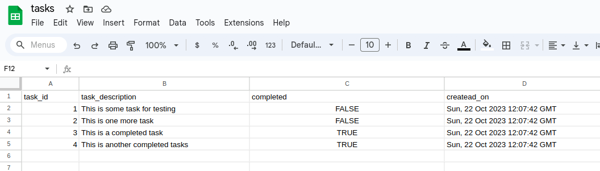

Now, we will learn how to read the data from the sheets. 
```js
const APP_ROOT_FOLDER = "CoolTodoApp";

/*
This function prints the completed tasks
*/
const _getCompletedTasks = () => {
  //Get the app folder
  let appFolder = DriveApp.getFoldersByName(APP_ROOT_FOLDER);
  if(appFolder.hasNext())
  {
    appFolder = appFolder.next();
  }
  else
  {
    console.log(`${APP_ROOT_FOLDER} not created`);
  }

  //search the sheet
  let sheetFile = appFolder.getFilesByName("tasks");
  if(sheetFile.hasNext())
  {
    sheetFile = sheetFile.next();
  }
  else
  {
    console.log("spreadsheet tasks not created");
    return;
  }

  //open the spreadsheet using SpreadSheetApp class
  let spreadsheet = SpreadsheetApp.open(sheetFile);
  //get the first sheet
  let sheet = spreadsheet.getSheets()[0];
  //get the tasks
  let tasks = sheet.getDataRange().getValues();
  //Firt row is the header, remove it
  tasks = tasks.slice(1);

  const completed_col_idx = 2;
  let completedTasks = tasks.filter(data => data[completed_col_idx] === true);
  console.log(completedTasks);
}
```

[`Sheet.getDataRange()`](https://developers.google.com/apps-script/reference/spreadsheet/sheet#getdatarange) gets the [Range](https://developers.google.com/apps-script/reference/spreadsheet/range) of cells that the sheet has. [`Range.getValues`](https://developers.google.com/apps-script/reference/spreadsheet/range#getvalues) get the values in the selected range. Then, we filter the rows which are completed.

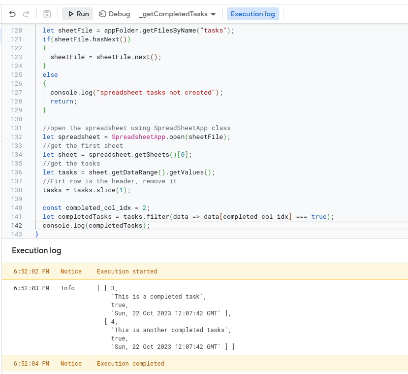

To update a cell, you should first get the row and col index to update. Then use [`Sheet.getRange`](https://developers.google.com/apps-script/reference/spreadsheet/sheet#getRange(Integer,Integer)) to get the [Range](https://developers.google.com/apps-script/reference/spreadsheet/range) object corresponding to a row and col (both row and col start with 1 for the first entry). Then use [`Range.setValue`](https://developers.google.com/apps-script/reference/spreadsheet/range#setvaluevalue) to update the cell value.
```js
const APP_ROOT_FOLDER = "CoolTodoApp";

const _updateRow = () => {
  //Get the app folder
  let appFolder = DriveApp.getFoldersByName(APP_ROOT_FOLDER);
  if(appFolder.hasNext())
  {
    appFolder = appFolder.next();
  }
  else
  {
    console.log(`${APP_ROOT_FOLDER} not created`);
  }

  //search the sheet
  let sheetFile = appFolder.getFilesByName("tasks");
  if(sheetFile.hasNext())
  {
    sheetFile = sheetFile.next();
  }
  else
  {
    console.log("spreadsheet tasks not created");
    return;
  }

  //open the spreadsheet using SpreadSheetApp class
  let spreadsheet = SpreadsheetApp.open(sheetFile);
  //get the first sheet
  let sheet = spreadsheet.getSheets()[0];
  //get the tasks
  let tasks = sheet.getDataRange().getValues();
  //Firt row is the header, remove it
  tasks = tasks.slice(1);

  const id_col_idx = 0;
  const task_desc_col_idx = 1;
  let updateTaskIdx = tasks.findIndex(data => data[id_col_idx] === 3) + 1; //+1 as slice removed the header
  let updateTaskCell = sheet.getRange(updateTaskIdx + 1, task_desc_col_idx + 1 ); //+1 as the A1 notation starts with 1 for the first row/col
  updateTaskCell.setValue("This task was update"); //update the value
}
```

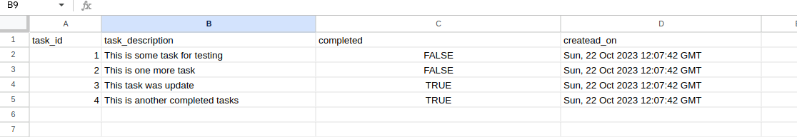

## Using Charts Service
[Charts Service](https://developers.google.com/apps-script/reference/charts) can be used to create charts. Let's see an example to create [Pie Chart](https://en.wikipedia.org/wiki/Pie_chart).
```js
const APP_ROOT_FOLDER = "CoolTodoApp";

const _generateReport = () => {
  let appFolder = DriveApp.getFoldersByName(APP_ROOT_FOLDER);
  if(appFolder.hasNext())
  {
    appFolder = appFolder.next();
  }
  else
  {
    console.log(`${APP_ROOT_FOLDER} not created`);
    return;
  }

  const ntasksCompleted = 10;
  const ntasksPending = 15;
  //Prepare data to create data table
  let data = Charts.newDataTable()
                .addColumn(Charts.ColumnType.STRING, "task_type") //add a column to describe type of task
                .addColumn(Charts.ColumnType.NUMBER, "value"); //add a column to describe value for that task type
  //add rows to the data table for completed and pending tasks
  data.addRow(["completed", ntasksCompleted]);
  data.addRow(["pending", ntasksPending]);
  //Build te data table
  let dataTable = data.build();

  //create a new chart
  let chartBuilder = Charts.newPieChart()
                      .setDataTable(dataTable)  //set the data source
                      .setDimensions(675,435)   //set the dimension
                      .set3D()                  //set 3D option
                      .setOption('chartArea',{left:10,top:10,width:`${675 - 20}`,height:`${435 - 20}`}) //add 10px padding on all side
                      .setOption('legend', {alignment:'center', position:'labeled'}) //set label option
                      .setOption('pieSliceText', 'none')  //don't display any content in the slice
  let chart = chartBuilder.build(); //build the chart with the given options
  let blob = chart.getBlob(); //get the Blob for the chart
  blob.setName("task-chart"); //give name to the blob

  appFolder.createFile(blob); //save the blob in the app's folder
  return blob;
}
```

If you run the `_generateReport` function, the chart created will be stored in the Drive's app folder (CoolTodoApp).

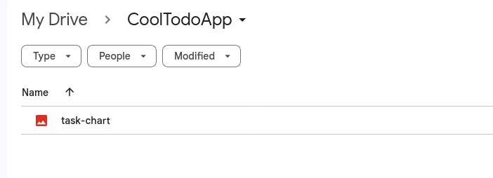

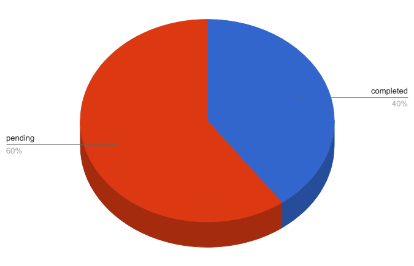

First, you create a data source for the pie chart. [`Charts.newDataTable`](https://developers.google.com/apps-script/reference/charts/charts#newdatatable) creates an empty [DataTableBuilder](https://developers.google.com/apps-script/reference/charts/data-table-builder). Using [`addColumn`](https://developers.google.com/apps-script/reference/charts/data-table-builder#addcolumntype,-label) you can add a column [of a type](https://developers.google.com/apps-script/reference/charts/column-type) and give it a label. Then, using [`addRow`](https://developers.google.com/apps-script/reference/charts/data-table-builder#addrowvalues) you can add rows to the data table. As we have added two columns in the data table, the rows are also two columns. You can chain multiple operations in a single statement like I have done with `.addColumn`. After setting the table data and options, you can use [`DataTableBuilder.build`](https://developers.google.com/apps-script/reference/charts/data-table-builder#build) to get the table. 

Now, you create a new chart, a pie chart in this case. [`Charts.newPieChart`](https://developers.google.com/apps-script/reference/charts/charts#newpiechart) creates a new chart of type "pie chart". You can add the data source using [`setDataTable`](https://developers.google.com/apps-script/reference/charts/pie-chart-builder#setdatatabletable). [`setDimensions`](https://developers.google.com/apps-script/reference/charts/pie-chart-builder#setdimensionswidth,-height), [`set3D`](https://developers.google.com/apps-script/reference/charts/pie-chart-builder#set3d), [`setOption`](https://developers.google.com/apps-script/reference/charts/pie-chart-builder#setoptionoption,-value) can be used for controlling the look of the chart. You can get the [list of all available options here](https://developers.google.com/chart/interactive/docs/gallery/piechart). After setting the data and options of the chart, you can use [`build`](https://developers.google.com/apps-script/reference/charts/pie-chart-builder#build) to build the chart. It will create a [Chart object](https://developers.google.com/apps-script/reference/charts/chart).


## Generating PDF report
We will need to create a report of tasks for a month for our "CoolTodoApp". There is no service or API to create [PDFs](https://en.wikipedia.org/wiki/PDF). We can however use [template HTML](templated-html-dynamic-html-rendering) to create a HTML report and export it as "PDF". [PDFs](https://en.wikipedia.org/wiki/PDF) should be designed such that it is optimized for printing. We can use CSS options to tailor our HTML for printing. [How to Create Printer-friendly Pages with CSS](https://www.sitepoint.com/css-printer-friendly-pages/) is a good reference. In this section, we will not focus on CSS optimization for printers. We will learn more about it when we create the report for our app.

Let's create a simple HTML template for a report
```html
<!DOCTYPE html>
<html>
  <head>
    <title>Creating PDF in Google app script</title>
    <style>
      body {
        box-sizing: border-box;
        font-size: 16pt;
      }

      @page {
        size: A4;
      }
      .pdf-page {
        width: 595pt !important;
        height: 842pt !important;
        margin: 0pt !important;
        padding: 0pt !important;
      }
    </style>
  </head>
  <body>
    <div class="pdf-page">
      <h2>Creating PDF using Google app script</h2>
      <figure>
        "/>
        <figcaption>Tasks completed</figcaption>
      </figure>
      <div>
        This is the pdf page. Added a image, title and some tasks.
      </div>
    </div>
  </body>
</html>
```

For the image source, I used base64 data as the image source. The base64 data is passed from the server and included in the template html. Also, note that I have used unescaped output syntax `<?!= data.todo_chart ?>` so that there is no contextual escaping. 

```js
function doGet(e)
{
  let report_chart = _generateReport();
  let template_data = {
    todo_chart : `data:image/png;base64,${Utilities.base64Encode(report_chart.getBytes())}` //encode into base64 from the blob bytes
  };
  //Render the htl template by passing the visitor_count data
  let report_templete = HtmlService.createTemplateFromFile("report-template.html");
  

  report_templete.data = template_data;
  const report_html = report_templete.evaluate();
  report_html.setTitle("Creating PDF in Google app script");
  return report_html;
}
```
Here, the `report_chart` is the blob returned from the `_generateReport` function from the [Charts tutorial](#using-chart-service). The blob is encoded to base64 data using [Utilities.base64Encode](https://developers.google.com/apps-script/reference/utilities/utilities#base64encodedata) and passed to the HTML template.

```js
const APP_ROOT_FOLDER = "CoolTodoApp";

function _generatePDF()
{
  let report_chart = _generateReport(); //get the pie chart blob
  let template_data = {
    todo_chart : `data:image/png;base64,${Utilities.base64Encode(report_chart.getBytes())}` //encode into base64 from the blob bytes
  };
  //Render the htl template by passing the visitor_count data
  let report_templete = HtmlService.createTemplateFromFile("report-template.html");
  report_templete.data = template_data; //pass the data to the template file
  const report_html = report_templete.evaluate();
  report_html.setTitle("Creating PDF in Google app script")
  const pdfReport = report_html.getBlob().getAs("application/pdf"); //convert the html to pdf
  let appFolder = DriveApp.getFoldersByName(APP_ROOT_FOLDER).next();
  appFolder.createFile(pdfReport);
  return pdfReport;
}
```
To convert the HTML report to PDF, you can get the blob using [`getBlob`](https://developers.google.com/apps-script/reference/html/html-output#getblob) and then convert it to PDF using [`getAs`](https://developers.google.com/apps-script/reference/base/blob.html#getascontenttype). `_generatePDF` function will create the PDF report and save it into the app folder.

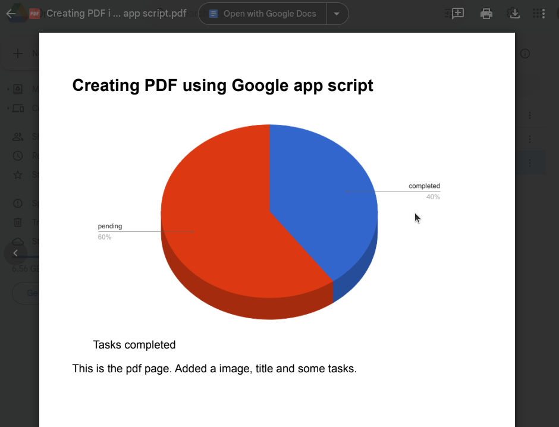

## Sending Email
[Gmail Service](https://developers.google.com/apps-script/reference/gmail) can be used to interact with Gmail service and send emails. Let's see an example of sending an email, with an attachment, to the current user.

```js
const _sendEmail = () => {
  const subject = "Sending email using app script";
  let pdfReport = _generatePDF();
  let template_data = {
    todo_chart : `cid:todo_chart` //cid format for embedding image in email
  };
  let report_chart = _generateReport(); //get the pie chart blob for embedding into email

  let report_templete = HtmlService.createTemplateFromFile("report-template.html");
  report_templete.data = template_data; //pass the data to the template file
  const report_html = report_templete.evaluate();

  MailApp.sendEmail(Session.getActiveUser().getEmail(), subject, "",  //compose email to current user's email 
                        {
                          htmlBody : report_html,  //adding email body from the html template
                          inlineImages : {"todo_chart":report_chart} //adding cid format inline images
                          attachments:[pdfReport], //add pdfReport as attachment
                        })
}
```

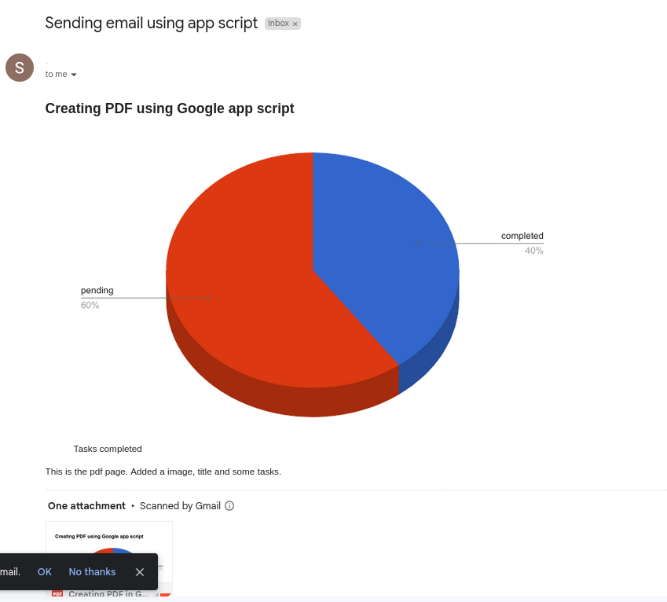

To send the email, we use [MailApp Service](https://developers.google.com/apps-script/reference/mail/mail-app). You can also use [GmailApp Service](https://developers.google.com/apps-script/reference/gmail/gmail-app) but [GmailApp](https://developers.google.com/apps-script/reference/mail/mail-app) will have full access to your inbox. Using [MailApp](https://developers.google.com/apps-script/reference/mail/mail-app), you have full control of the email, so for just sending emails, it is better to use [MailApp](https://developers.google.com/apps-script/reference/mail/mail-app).

[MailApp.sendEmail](https://developers.google.com/apps-script/reference/mail/mail-app#sendemailrecipient,-subject,-body,-options) is the most flexible way to send an email. First, we set the receiver address to the current user's email address using  [Session.getActiveUser().getEmail()](https://developers.google.com/apps-script/reference/base/user#getEmail()). Then, we set the subject and leave the body blank. For the email body, we will use HTML format. In the options, we add `htmlBody` to the HTML report generated from the template. Note that to add images to the email HTML body, you will need to use [CID format](https://www.rfc-editor.org/rfc/rfc1873). For the image src, I have used `cid:todo_chart`. The prefix `cid:` indicates it is the [CID format](https://www.rfc-editor.org/rfc/rfc1873) inline image, and `todo_chart` is the identifier. In the options, I have set `inlineImages` to a key-value pair, with the key being the cid identifier and the value being the Blob for the image. I have also added the `pdfReport` as the `attachments` options, to add the attachment.

## Triggering events
There are a couple of event-based triggers that can be used to automate things. Events are some actions or some conditions like the client sending [GET](https://developer.mozilla.org/en-US/docs/Web/HTTP/Methods/GET), the user installing an app script, time-driven events like the first of every month, every day, every hour, etc. The [`doGet and doPost`](https://developers.google.com/apps-script/guides/triggers#dogete_and_doposte) are also triggered when the [GET](https://developer.mozilla.org/en-US/docs/Web/HTTP/Methods/GET) / [POST](https://developer.mozilla.org/en-US/docs/Web/HTTP/Methods/POST) request (event) is sent to the server. 

Our "CoolTodoApp" will send a monthly report of tasks to the user's email. This is basically calling the [`_sendEmail`](#sending-email) on the first of every month.  Let's set a monthly trigger [manually](https://developers.google.com/apps-script/guides/triggers/installable#manage_triggers_manually). Click on the "Triggers" option.

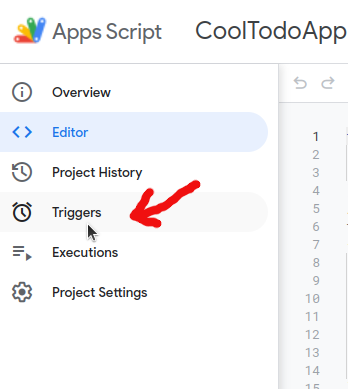

Click on "Add Trigger" and fill in the parameters for a monthly trigger. Set the function to [`_sendEmail`](#sending-email), deployment as "HEAD", "Time-driven", "Month timer", and 1st 7-8 am, then save it. Now, [`_sendEmail`](#sending-email) will automatically be called on the first or every month between 7-8 am in the user's timezone. To delete the trigger, go the the "Triggers" tab and delete the trigger.

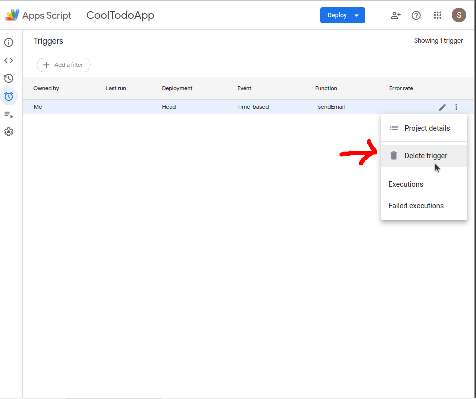

We can also [add triggers programmatically](https://developers.google.com/apps-script/guides/triggers/installable#manage_triggers_programmatically).

```js

//install trigger that run on the first of every
//month and calls teh _sendEmail function
const _installMonthlyReportTrigger = () => {
  let scriptProperties = PropertiesService.getScriptProperties();
  if(!scriptProperties.getProperty('monthly_report_trigger_id'))
  {
    //initialize the visitor_count
    scriptProperties.setProperty('monthly_report_trigger_id', -1);
  }

  //get the trigger id stored
  let saved_trigger_id = scriptProperties.getProperty('monthly_report_trigger_id');
  let trigger_installed = false;
  const allTriggers = ScriptApp.getProjectTriggers();
  //check if the trigger with the saved id is already present
  for (let index = 0; index < allTriggers.length; index++) {
    // If the current trigger is the correct one, delete it.
    if (allTriggers[index].getUniqueId() === saved_trigger_id) {
      trigger_installed = true;
      break;
    }
  }

  //install the trigger only once
  if(trigger_installed === false)
  {
    let triggerBuilder = ScriptApp.newTrigger('_sendEmail') //create a trigger that calls _sendEmail
                        .timeBased()    //create a tiem based trigger builder
                        .onMonthDay(1)  //trigger on first of every month
                        .atHour(8)      //trigger on 8am - 9am
    let trigger = triggerBuilder.create(); //install the trigger
    //update the saved trigger id so that the trigger is not installed next time this function is called
    scriptProperties.setProperty('monthly_report_trigger_id', trigger.getUniqueId());
  }
}
```

The function `_installMonthlyReportTrigger`, creates a new trigger using [`ScriptApp.newTrigger`](https://developers.google.com/apps-script/reference/script/script-app#newtriggerfunctionname), adds a timer-based trigger using [`TriggerBuilder.timeBased`](https://developers.google.com/apps-script/reference/script/trigger-builder#timebased) and configures it to run on the first of every month using [`ClockTriggerBuilder.onMonthDay`](https://developers.google.com/apps-script/reference/script/clock-trigger-builder#onmonthdayday) and at 8-9 am using [`ClockTriggerBuilder.atHour`](https://developers.google.com/apps-script/reference/script/clock-trigger-builder#athourhour). The trigger is then installed using [`ClockTriggerBuilder.create`](https://developers.google.com/apps-script/reference/script/clock-trigger-builder#create). If you run this function, it will install the trigger automatically. Note how I have used [Properties Service](https://developers.google.com/apps-script/guides/properties) to make sure the trigger is installed only once.

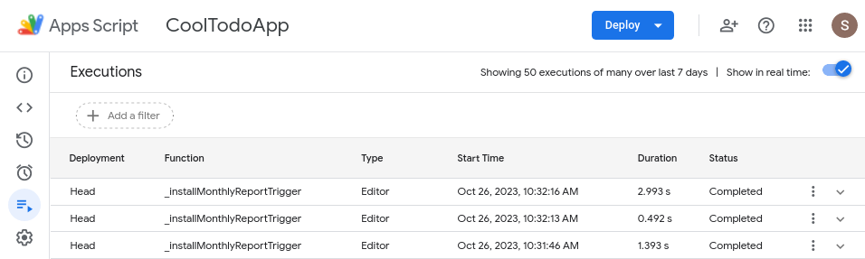

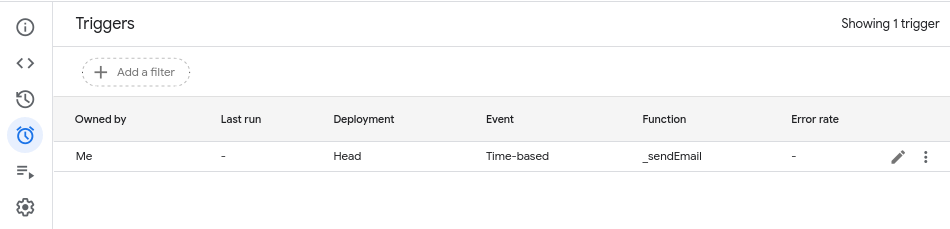

## Using Lock Service
[Lock or mutex](https://en.wikipedia.org/wiki/Lock_(computer_science)) are [Synchronization primitives](https://en.wikipedia.org/wiki/Synchronization_(computer_science)) in computer science used to restrict access to a particular object to only one process or task even when multiple processes are trying to access it.

Let's consider a scenario in our "CoolTodoApp". `_getRootFolder` is a function that creates the app's root folder if it doesn't exist and returns the id. Let's say we have two endpoints `GetPendingTask` and `GetCompletedTask` that return the pending and completed tasks resp. We know that both of these functions will be calling the `createRootFolder` at some point.
```js
//Code.gs
const APP_ROOT_FOLDER = "CoolTodoAppTest";

/*
Cretes the app's root folder if it doesn't exists
and returns the folder id
*/
const _getRootFolder = () => {
  let folder = DriveApp.getFoldersByName(APP_ROOT_FOLDER);
  if(folder.hasNext() === false)
  {
    //doesn't exists, create folder
    folder = DriveApp.createFolder(APP_ROOT_FOLDER);
  }
  else
  {
    //folder already exists
    folder = folder.next();
  }
  return folder.getId();
}

const GetCompletedTask = () => {
  let appFolderId = _getRootFolder();
  //some more logic to get the data from spreadsheet
  return []; //returning dummy data
}

const GetPendingTask = () => {
  let appFolderId = _getRootFolder();
  //some more logic to get the data from spreadsheet
  return []; //returning dummy data
}

function doGet(e)
{
  return HtmlService.createHtmlOutputFromFile("index.html")
}
```

On the client side, we will need to fetch both the completed and pending tasks.
```html
<!-- index.html -->
<html>
  <body>
    <script>
      const handleCompletedTasks = (tasks) => {
        console.log("got completed tasks");
      }
      const handlePeningTasks = (tasks) => {
        console.log("got pending tasks");
      }
      const getTasks = () => {
        //call both GetCompletedTask and GetPendingTask
        google.script.run.withSuccessHandler(handleCompletedTasks).GetCompletedTask();
        google.script.run.withSuccessHandler(handlePeningTasks).GetPendingTask();
      }

      window.onload = getTasks;
    </script>
  </body>
</html>
```

Now let's open the client-side app.

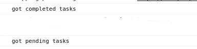

If you look in your Google Drive, you will notice that there are 2 folders named "CoolTodoAppTest" created.

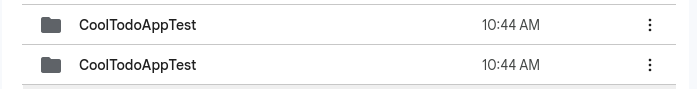

But we have added checks to check if the folder already exists in the `_getRootFolder` function. So why does this happen? This is a [synchronization](https://en.wikipedia.org/wiki/Synchronization_(computer_science)) issue. Since the client side [`google.script.run`](https://developers.google.com/apps-script/guides/html/reference/run) is not synchronous (blocking call), both  `GetCompletedTask` and `GetPendingTask` are called at the same time. So, there arises a situation where the first call has checked that the folder doesn't exist and goes in the condition where the folder is created, but before the folder is created, the second call to `GetPendingTask` is already made and in that call also the folder doesn't exist. So, both calls create a new folder.

[Lock Service](https://developers.google.com/apps-script/reference/lock) can be used to solve this problem. Using a lock ensures a part of the code is executed only by one process at a time, even if multiple processes try to execute the same code at the same time. Let's update the `_getRootFolder` function.
```js
const _getRootFolder = () => {
  let lock = LockService.getScriptLock(); //Get the script lock
  let status = lock.tryLock(5000); //Acquire the lock (only one process can get it at a time)

  let folder = DriveApp.getFoldersByName(APP_ROOT_FOLDER);
  if(folder.hasNext() === false)
  {
    //doesn't exists, create folder
    folder = DriveApp.createFolder(APP_ROOT_FOLDER);
  }
  else
  {
    //folder already exists
    folder = folder.next();
  }

  if(status)
  {
    lock.releaseLock(); //release the lock so that other process can acquire it
  }
  return folder.getId();
}
```

Now delete the two "CoolTodoAppTest" folders from your Google Drive and load the client UI again. This time you will see that only one folder is created. You can get the lock (only one lock is available per script) using [`LockService.getScriptLock`](https://developers.google.com/apps-script/reference/lock/lock-service#getscriptlock), acquire (lock the section of code) using [`Lock.tryLock`](https://developers.google.com/apps-script/reference/lock/lock#trylocktimeoutinmillis) and then release (unlock the section of code) using [`Lock.releaseLock`](https://developers.google.com/apps-script/reference/lock/lock#releaselock).

## Meta tag and client side metadata
Meta tags included directly in an Apps Script HTML file are ignored. If you want to add the meta tag to HTML, you can use server-side [`addMetaTag`](https://developers.google.com/apps-script/reference/html/html-output#addmetatagname,-content). Let's add [viewport](https://www.w3schools.com/css/css_rwd_viewport.asp) metadata to make our app responsive on mobile devices.
```js
function doGet(e)
{
  let html = HtmlService.createHtmlOutputFromFile(filename);
  //add metatag
  html.rendered_html.addMetaTag('viewport', 'width=device-width, initial-scale=1');
}
```
[HtmlOutput](https://developers.google.com/apps-script/reference/html/html-output) provides a bunch of other methods to control html metadata.
```js

function doGet(e)
{
  let html = HtmlService.createHtmlOutputFromFile(filename);
  //set the title of client-side HTML
  html.setTitle("CoolTodoApp")
  //set the favicon
  html.setFaviconUrl("https://drive.google.com/uc?id=1twzpy63EbJV4b9U91UtgSZw7Zi8Ou5Lr&export=download&format=png");
}
```

You can set the title using [`setTitle`](https://developers.google.com/apps-script/reference/html/html-output#settitletitle). You can add a [favicon](https://en.wikipedia.org/wiki/Favicon) using [`setFaviconUrl`](https://developers.google.com/apps-script/reference/html/html-output#setfaviconurliconurl).


## Building server-side API
The Server side will support the following functionalities (Functional requirements):
* Client shall be able to fetch completed and pending tasks
* Client shall be able to add new tasks, mark a task as complete/incomplete
* Tasks shall be stored in Google Sheets
* Tasks for each day shall be stored in separate google sheets
* Tasks sheets shall be stored in google drive
* Google Drive shall contain folders for each month
* A summarized report for the tasks for a month shall be sent as an attachment

So, we will expose some endpoints (server-side functions) to the users. All the exposed APIs are kept in `Code.gs`. We will need some utility functions that talk to the Google services (like Google Sheets and Google Drive). We will keep these in `gapi.gs`. We will also need to generate a report from the tasks for a month. We will keep this in `report.gs`. Let's keep all other utility functions in `utility.gs`. `constants.gs` will contain the server configurable values. We will also need a HTML template for our report, let's keep it in `report-template.html` So the file structure for the server-side is as follows:
```txt
├── Code.gs
├── gapi.gs
├── report.gs
├── utility.gs
├── constants.gs
├── report-template.html
```

[Have a look at this](./src/) for the final source code. We will have a look at the files one by one.

Let's start with the APIs to interact with Google services [`gapi.gs`](./src/gapi.gs). There is a class named `gAPI` that [encapsulates](https://en.wikipedia.org/wiki/Encapsulation_(computer_programming)) all the [methods](https://en.wikipedia.org/wiki/Method_(computer_programming)) needed to interact with the Google service for our use case. We know that we will have three hierarchies of files. All the app-related stuff will go in the App's folder. It is represented by the [member variable](https://en.wikipedia.org/wiki/Member_variable) `this.rootFolder`. `this.rootFolder` contains info about the root folder's id and [Folder](https://developers.google.com/apps-script/reference/drive/folder) object. To create the folder name, there is a [method](https://en.wikipedia.org/wiki/Method_(computer_programming)) named `setRootAppFolder`. This method creates the app's root folder if it doesn't exist and then sets `this.rootFolder`. This method is [synchronized using Lock](#using-lock-service). Similarly, there are `setMonthFolder` and `setTodoSheet` methods to set the month folder and todo spreadsheet resp. `checkSheetExists` checks if the sheet already exists for the day. There are methods to get tasks, add tasks update tasks, etc. Global instance `GAPI` can be used to call these methods.


[`constants.gs`](./src/constants.gs) contains a const variable named `CONSTANTS` that stores some server-side configurable values like the app's folder name, sheet headers, etc.


[`utility.gs`](./src/utility.gs) contains utility functions like a function to extract the month name from a date, input validation functions, a function to get the last day of the previous month, etc.

Now, we can start exposing our APIs. [`Code.gs`](./src/Code.gs) exposes the APIs to add tasks, update tasks as completed or pending, and get completed or pending tasks. These APIs validate the input and call the `GAPI` methods. `doGet` constructs HTML output from the template, sets some meta tags and returns the output.

We also need to change the client-side HTML files. Instead of adding data statically, we need to fetch the tasks from the server. [`client-script.html`](./src/client-script.html) contains the logic to fetch the task from the server, add a task when the user submits the task form, and update a task when a user checks or unchecks a task.

Our "CoolTodoApp" is complete for the most part. The only thing remaining is the report generation feature. Let's create the template for the report.  We need to decide on what to put in the report. The report should contain enough data to give an idea of tasks for the previous month, but it should not be overwhelming and mention every task. I have divided the report into two parts. The first page contains a pie chart and some data points summarizing the tasks for the previous month. The second page and after contain a table with summarized data for each day. I have also added a link to the task spreadsheet for each day in the table. [`report-template.html`](./src/report-template.html) is the HTML template for the report. [Have a look at this](https://drive.google.com/file/d/1JWd5uy-d643yEtSf87uDFkF1P4OcGzRm/view?usp=drive_link) for the report sample.

[`report.gs`](./src/report.gs) contains the functions needed to generate and send the report. `_testReportTemplate` is the test function used to generate a dummy report from the template. `_getTasksSummary` returns rows of summarized tasks (date, #completed_tasks, #pending_tasks, #total_tasks, spreadsheet_link) for days between `start_date` and `end_date` (both inclusive).  `_generateTasksChart` generates the pie chart summarizing the tasks. `_getReportData` returns the data for the `report-template.html` template. `_sendMonthlyEmailReport` generates the report and sends it to the current user. `_installMonthlyReportTrigger` installs the monthly trigger to call `_sendMonthlyReportTriggerCallback` which calculates the  `start_date` and `end_date` for the previous month and calls the `_sendMonthlyEmailReport`.

# Deploying final CoolTodoApp
We are done with coding the "CoolTodoApp". We have been using "Test Deployment" till now. We need to create a new deployment. Click on "Deploy", then "New Deployment" and add a description for the app. Change "Execute as" to "User accessing the web app" so that when you share the app link with others, the app will run on that user's context, not yours. Change "Who has access" to "Anyone". Note how I am calling `_installMonthlyReportTrigger` in `doGet`. This way the trigger is installed in the other user's account as well, when you share the app link.

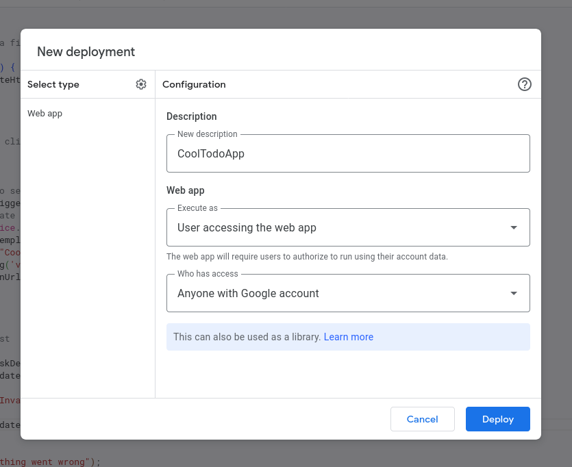

Open the deployed link and start sharing it with your friends. They can deploy an instance of this app in their own Google account and start tracking the tasks. [Here](https://github.com/sauravshah31/technical-blogs/google-apps-script-1/src) is the final source code and [this](https://script.google.com/macros/s/AKfycbzSsEGHd56mxZv-1TnJ1abSW4bqlD1OI7ciFYL6L8bYsCX1SBUgosvSzXXss1xBIY3cEw/exec) is the todo app we have built.

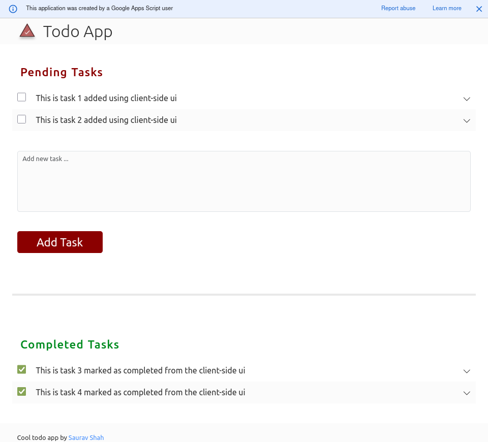

---

<blockquote>
Wowza! 🚀 We've created a mind-blowing web app with the power of Google Apps Script! 🌟 Learning has never been this thrilling! 🤓📚 Time to dive into the awesomeness of your CoolTodoApp and stay on top of your tasks like a pro. 📅💪

Just think about how this journey began – understanding the mystical world of Apps Script, brainstorming the app features, diving into APIs, building small features and then layering on more cool stuff until we had our magnificent web app masterpiece. 🎨💼

Now, you're not just a user; you're an explorer of endless possibilities! 🌠🌈 You can even unleash your creativity by [publishing your very own extensions](https://developers.google.com/apps-script/add-ons/how-tos/publish-add-on-overview) or more sensational Cool Apps. 🚀🎉

And don't forget to share your spectacular creations with me on [Twitter](https://twitter.com/sauravshah31) – I can't wait to see what you've cooked up! 👀 [@sauravshah31](https://twitter.com/sauravshah31)

</blockquote>